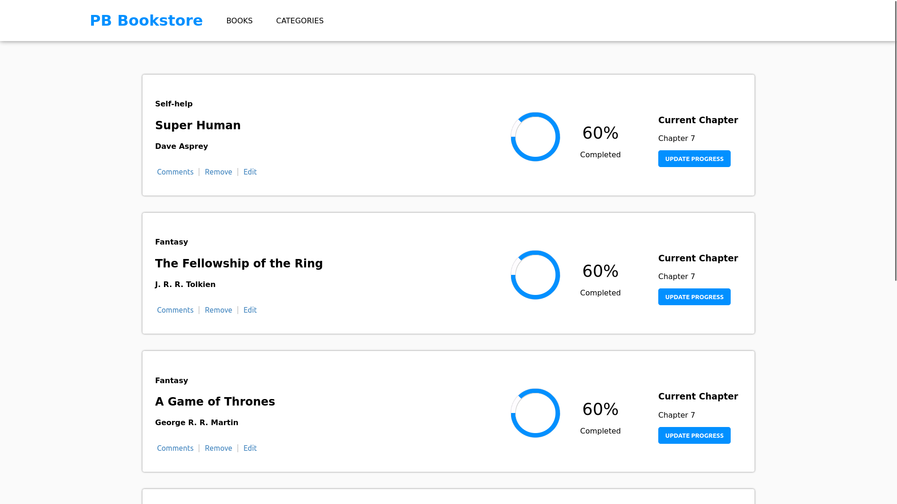
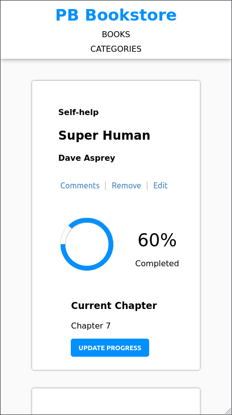

# Project Name

Book Store

# Description the project.

Building a "Book Store" app using React with redux.
The app has features like adding & removeing books using an API

## Built With

- JavaScript
- CSS
- HTML
- WebPack
- React
- Redux
- Netlify deployment

## Screenshots

## Link to the Page

[Live Demo](https://pb-book-store.netlify.app/)

## Getting Started

### Setup
- You need to have Node, npm & git installed.
- Clone the repository using this command `git clone https://github.com/Peter1907/book-store.git`.
-You can also [Download the ZIP from this location](https://github.com/Peter1907/book-store/archive/refs/heads/dev.zip)
- You can open the "book-store" folder using VSCode or any other editor.
- Use `npm i` to install all required node modeules.
- Use `npm start` command to open a live server.

## Authors

👤 **Author1**

- GitHub: [@Peter1907](https://github.com/Peter1907)
- Twitter: [@Peter_Beshara_](https://twitter.com/Peter_Beshara_)
- LinkedIn: [LinkedIn](https://www.linkedin.com/in/peter-beshara-b33681241/)

## 🤝 Contributing

Contributions, issues, and feature requests are welcome!

You can clone the repo using this link (https://github.com/Peter1907/book-store.git)

Feel free to check the [issues page](https://github.com/Peter1907/book-store/issues).

## Show your support

Give a ⭐️ if you like this project!

## Acknowledgments

- A big kudos to everyone who worked hard to make this project a success.
- <a href="https://www.flaticon.com/free-icons/book" title="book icons">Book icons created by Freepik - Flaticon</a>.

## 📝 License

This project is [MIT](./MIT.md) licensed.
